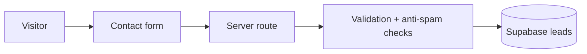

<div align="center">

# 🚜 MoldAgroTech

### Digital infrastructure for modern agriculture in Moldova

A multilingual corporate website for a Moldovan AgriTech company focused on **agricultural data, IoT, automation, analytics and AI-assisted decision support**.


</div>

---

## Product goal

MoldAgroTech presents one coherent digital entry point for farmers, partners and organizations evaluating agricultural technology.

The site is structured around:

- 🌱 precision-agriculture solutions;
- 📡 IoT and field-data collection;
- ⚙️ automation and operational workflows;
- 📊 analytics and decision support;
- 🤖 AI-assisted interpretation of agricultural data;
- 🤝 partnerships and commercial inquiries.

## Languages

The application exposes dedicated locale routes for:

- 🇷🇴 Romanian
- 🇷🇺 Russian
- 🇬🇧 English

The root route redirects to `/ro`.

## Main routes

```text
/[locale]
/[locale]/solutions
/[locale]/technology
/[locale]/industries
/[locale]/about
/[locale]/partners
/[locale]/insights
/[locale]/contact
```

Legal placeholder pages exist under:

```text
/[locale]/legal/*
```

They must be reviewed and replaced with verified production legal information before a commercial launch.

## Tech stack

| Area | Technology |
|---|---|
| Framework | Next.js 15.5 / App Router |
| UI | React 19.1 |
| Language | TypeScript 5.7 |
| Styling | Tailwind CSS 3.4 |
| Lead storage | Supabase |
| Icons | Lucide React |
| Deployment target | Vercel |

## Lead flow



The public form includes:

- server-side validation;
- a honeypot field;
- minimum-submit-time protection;
- server-only use of the Supabase service-role key.

For a high-traffic public launch, add distributed / edge rate limiting and optionally a challenge layer such as Turnstile.

## Local development

```bash
git clone https://github.com/xondell/moldagrotech.git
cd moldagrotech
npm install
cp .env.example .env.local
npm run dev
```

Quality checks:

```bash
npm run typecheck
npm run lint
npm run build
```

## Supabase setup

1. Create a Supabase project.
2. Apply:

```text
supabase/migrations/001_leads.sql
```

3. Configure:

```env
NEXT_PUBLIC_SUPABASE_URL=
SUPABASE_SERVICE_ROLE_KEY=
NEXT_PUBLIC_SITE_URL=
```

> `SUPABASE_SERVICE_ROLE_KEY` is server-only. Never expose it as a `NEXT_PUBLIC_*` variable.

## Content integrity

This repository intentionally avoids invented business proof.

The site does **not** fabricate:

- customers;
- partner logos;
- awards;
- team members;
- testimonials;
- performance statistics;
- measured agricultural outcomes.

Before commercial launch, replace placeholders with verified company contacts, legal details, team information, cases, metrics and approved visual assets.

## Security / deployment notes

The initial deployment cycle included a dependency security update for the React Server Components ecosystem. Keep framework dependencies patched and review automated dependency-security PRs before merging.

For Vercel:

1. import the GitHub repository;
2. configure environment variables;
3. set `NEXT_PUBLIC_SITE_URL` to the canonical production domain;
4. test all locale routes and the lead form;
5. verify that server credentials never appear in the client bundle.

## Repository helpers

Ubuntu/Linux automation is included:

```bash
chmod +x setup-public-github.sh
./setup-public-github.sh
```

See `VERCEL_SETUP.md` for deployment-specific configuration.

---

<div align="center">

**MoldAgroTech — data, automation and better agricultural decisions.**

</div>
